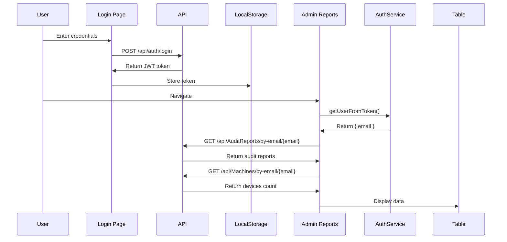

# 🔍 Admin Reports API Debugging Guide

## ❌ Issue: "Failed to load report data from API"

---

## 🎯 Quick Diagnosis Steps

### Step 1: Open Browser Console
1. Go to `/admin/reports` page
2. Press **F12** (or Ctrl+Shift+I)
3. Click **Console** tab
4. Refresh the page (Ctrl+R)

### Step 2: Find These Logs

Look for logs in this order:

```
📋 Fetching audit reports for email: [your-email@example.com]
📥 API Response: { success: true/false, data: [...], error: "..." }
```

If successful:
```
✅ Successfully loaded X audit reports
🖥️ Total devices for user: Y
✅ Mapped X reports with device counts
```

If failed:
```
❌ No user email found from token
❌ API call failed: [error message]
❌ Error in loadReportsData: [error details]
```

---

## 🔧 Common Issues & Solutions

### Issue 1: "❌ No user email found"
**Cause**: Not logged in or JWT token expired

**Solution**:
```bash
1. Logout from admin panel
2. Login again with valid credentials
3. Token should refresh automatically
```

**Verify**: Console should show valid email after login

---

### Issue 2: "❌ API call failed: Network Error"
**Cause**: API server not responding

**Check**:
```bash
# Test API manually
Open: https://api.dsecuretech.com/api/health
Should return: 200 OK
```

**Solution**:
- Check internet connection
- Verify API server is running
- Check firewall/antivirus not blocking requests

---

### Issue 3: "❌ API call failed: 401 Unauthorized"
**Cause**: Invalid or expired JWT token

**Console Check**:
```javascript
// In console, check token
localStorage.getItem('token')
// Should show valid JWT token
```

**Solution**:
```bash
1. Clear browser cache (Ctrl+Shift+Delete)
2. Logout and login again
3. Token will be refreshed
```

---

### Issue 4: "❌ API call failed: 404 Not Found"
**Cause**: API endpoint doesn't exist or email not found

**Verify Endpoint**:
```
Endpoint: /api/AuditReports/by-email/{email}
Example: /api/AuditReports/by-email/admin@example.com
```

**Solution**:
- Verify email exists in database
- Check API logs for this endpoint
- Ensure email format is correct

---

### Issue 5: "ℹ️ No audit reports found for this user"
**Cause**: User has no reports yet (not an error)

**Expected**: Empty table with "No reports found" message

**To Test**: Create a test report for this user

---

### Issue 6: CORS Error
**Console Shows**:
```
Access to fetch at 'https://api.dsecuretech.com' from origin 'http://localhost:5173' 
has been blocked by CORS policy
```

**Solution**:
Backend needs to allow frontend origin in CORS policy:
```csharp
// In .NET API Startup.cs or Program.cs
services.AddCors(options => {
    options.AddPolicy("AllowFrontend", builder => {
        builder.WithOrigins("http://localhost:5173", "https://yourdomain.com")
               .AllowAnyMethod()
               .AllowAnyHeader()
               .AllowCredentials();
    });
});
```

---

## 🧪 Manual API Testing

### Test 1: Health Check
```bash
# Open in browser
https://api.dsecuretech.com/api/health
# Expected: 200 OK
```

### Test 2: Get Audit Reports
```bash
# Using curl (in PowerShell)
$token = "YOUR_JWT_TOKEN_HERE"
$email = "YOUR_EMAIL_HERE"

Invoke-WebRequest -Uri "https://api.dsecuretech.com/api/AuditReports/by-email/$email" `
  -Headers @{
    "Authorization" = "Bearer $token"
    "Content-Type" = "application/json"
  }
```

### Test 3: Get Machines/Devices
```bash
# Using curl
Invoke-WebRequest -Uri "https://api.dsecuretech.com/api/Machines/by-email/$email" `
  -Headers @{
    "Authorization" = "Bearer $token"
    "Content-Type" = "application/json"
  }
```

---

## 📊 Expected API Response Format

### AuditReports API Response:
```json
{
  "success": true,
  "data": [
    {
      "report_id": "REPORT-001",
      "report_name": "IT Department",
      "report_datetime": "2025-01-18T10:30:00Z",
      "status": "completed",
      "user_email": "admin@example.com"
    }
  ],
  "error": null
}
```

### Machines API Response:
```json
{
  "success": true,
  "data": [
    {
      "machine_id": "MACHINE-001",
      "machine_name": "PC-001",
      "user_email": "admin@example.com"
    }
  ],
  "error": null
}
```

---

## 🛠️ Advanced Debugging

### Enable Network Tab Inspection
1. Open F12 Console
2. Go to **Network** tab
3. Refresh page
4. Look for these requests:
   - `GET /api/AuditReports/by-email/[email]`
   - `GET /api/Machines/by-email/[email]`

### Check Request Details:
- **Status Code**: Should be 200
- **Response Tab**: See actual data returned
- **Headers Tab**: Verify Authorization header is present

### Check Response Time:
- If > 5 seconds: API performance issue
- If timeout: Network/firewall issue

---

## 🔐 Authentication Flow



---

## 📝 Console Logs Reference

All console logs added to AdminReports.tsx:

| Log Type | Message | Meaning |
|----------|---------|---------|
| 📋 | "Fetching audit reports for email: X" | Starting API call |
| 📥 | "API Response: {...}" | Raw API response |
| ✅ | "Successfully loaded X audit reports" | Data fetched successfully |
| ℹ️ | "No audit reports found for this user" | User has no reports (not error) |
| 🖥️ | "Total devices for user: X" | Device count fetched |
| ✅ | "Mapped X reports with device counts" | Data processing complete |
| ❌ | "No user email found" | Authentication issue |
| ❌ | "API call failed: X" | API error occurred |
| ❌ | "Error in loadReportsData: X" | Unexpected error |

---

## 🎯 What to Share for Support

If issue persists, share these details:

1. **Console Logs** (copy all red ❌ messages)
2. **Network Tab** screenshot showing:
   - Request URL
   - Status code
   - Response body
3. **Browser**: Chrome/Firefox/Edge version
4. **User Email**: Email you're logged in with
5. **Steps to Reproduce**:
   - What you clicked
   - What happened vs what expected

---

## ✅ Success Indicators

When working correctly, you should see:

### Console Logs:
```
📋 Fetching audit reports for email: admin@example.com
📥 API Response: { success: true, data: Array(5), error: null }
✅ Successfully loaded 5 audit reports
📥 Machines API Response: { success: true, data: Array(10), error: null }
🖥️ Total devices for user: 10
✅ Mapped 5 reports with device counts
```

### UI Display:
- ✅ Table shows data rows
- ✅ Each row shows: Report ID, Date, Device count, Status, Department
- ✅ Filters work (date range, status, department)
- ✅ Search works (by Report ID)
- ✅ Pagination works

---

## 🚀 Next Steps

1. **Check console logs** (Step 1 above)
2. **Identify error type** (use table above)
3. **Apply solution** (from Common Issues section)
4. **Test manually** (using curl commands if needed)
5. **Share logs** (if issue persists)

---

## 📞 Need Help?

If you've tried all above steps and still facing issues:

1. **Screenshot** console logs (entire Console tab)
2. **Screenshot** Network tab (showing failed request)
3. **Copy-paste** exact error message
4. **Share** your user email (used to login)

**Contact**: Share these details in our support chat

---

## 🔄 Quick Reset (Last Resort)

If nothing works:

```bash
1. Logout from admin panel
2. Clear browser data:
   - Press Ctrl+Shift+Delete
   - Select "Cookies and site data"
   - Select "Cached images and files"
   - Click "Clear data"
3. Close browser completely
4. Open browser again
5. Login to admin panel
6. Navigate to /admin/reports
7. Check console logs
```

---

**Note**: This guide was created to help diagnose the "Failed to load report data from API" error. Follow steps in order for best results.
