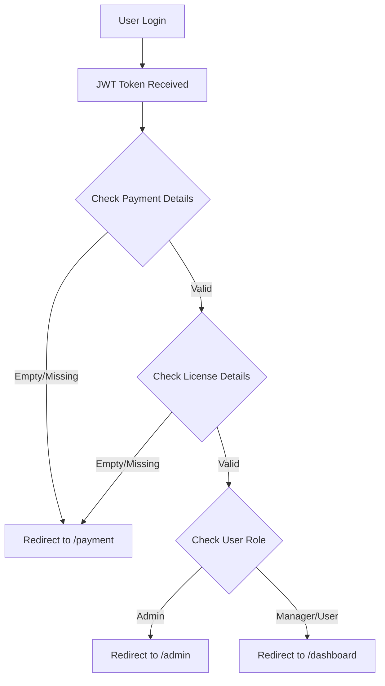

# 🎯 JWT Authentication with Payment/License Redirect Implementation

## ✅ Complete Implementation Done!

आपका JWT authentication system अब payment और license details की validation के साथ complete हो गया है। यहाँ है क्या implement किया गया है:

### 🔧 **New Features Added:**

1. **JWT Token में Payment/License Data**: JWT payload में payment और license fields
2. **Smart Redirect Logic**: Login के बाद user के setup status के basis पर redirect
3. **Payment/License Validation**: Empty `{}` brackets का proper detection
4. **PaymentSetupPage**: Complete setup flow for payment और license details
5. **Setup Status Guards**: Components to check और enforce setup completion

### 🚀 **How the Smart Redirect Works:**



### 📋 **JWT Token Structure Required:**

Your backend JWT should include:

```json
{
  "sub": "user123",
  "email": "user@example.com",
  "name": "John Doe", 
  "role": "user",
  "department": "IT",
  "payment_details_json": "{\"payment_method\":\"card\",\"status\":\"active\"}",
  "license_details_json": "{\"license_type\":\"standard\",\"status\":\"active\"}",
  "phone_number": "+1234567890",
  "is_private_cloud": false,
  "private_api": true,
  "exp": 1640995200,
  "iat": 1640991600
}
```

### 🛠️ **Backend Integration Required:**

#### **Empty/Incomplete Data Detection:**
System checks for these conditions as "incomplete":
- `payment_details_json: ""` (empty string)
- `payment_details_json: "{}"` (empty JSON object)
- `payment_details_json: null` or `undefined`
- Same logic applies for `license_details_json`

#### **Valid Data Example:**
```json
{
  "payment_details_json": "{\"payment_method\":\"card\",\"card_last4\":\"1234\",\"status\":\"active\"}",
  "license_details_json": "{\"license_type\":\"professional\",\"license_count\":5,\"status\":\"active\"}"
}
```

### 🎯 **Testing Scenarios:**

#### **Scenario 1: Complete User (No Redirect)**
```json
{
  "payment_details_json": "{\"payment_method\":\"card\",\"status\":\"active\"}",
  "license_details_json": "{\"license_type\":\"standard\",\"status\":\"active\"}"
}
```
**Expected:** User goes directly to dashboard/admin

#### **Scenario 2: Missing Payment (Redirect to Payment)**
```json
{
  "payment_details_json": "{}",
  "license_details_json": "{\"license_type\":\"standard\",\"status\":\"active\"}"
}
```
**Expected:** User redirected to `/payment`

#### **Scenario 3: Missing License (Redirect to Payment)**
```json
{
  "payment_details_json": "{\"payment_method\":\"card\",\"status\":\"active\"}",
  "license_details_json": ""
}
```
**Expected:** User redirected to `/payment`

#### **Scenario 4: Both Missing (Redirect to Payment)**
```json
{
  "payment_details_json": "{}",
  "license_details_json": "{}"
}
```
**Expected:** User redirected to `/payment`

### 🧪 **How to Test:**

#### **1. Test with Browser Console:**
```javascript
// After login, check authentication service
authService.isAuthenticated()

// Check payment status
authService.hasValidPaymentDetails()

// Check license status  
authService.hasValidLicenseDetails()

// Check complete setup
authService.isUserSetupComplete()

// Get smart redirect path
authService.getRedirectPath()
```

#### **2. Test AuthContext Hooks:**
```javascript
// In a React component
const { 
  hasValidPaymentDetails, 
  hasValidLicenseDetails, 
  isUserSetupComplete,
  getSmartRedirectPath 
} = useAuth()

// //console.log({
//   hasPayment: hasValidPaymentDetails(),
//   hasLicense: hasValidLicenseDetails(), 
//   isComplete: isUserSetupComplete(),
//   redirectPath: getSmartRedirectPath()
// })
```

#### **3. Test Setup Status Hook:**
```javascript
// In a React component
const setupStatus = useSetupStatus()

// //console.log({
//   hasPayment: setupStatus.hasPayment,
//   hasLicense: setupStatus.hasLicense,
//   isComplete: setupStatus.isComplete,
//   progress: setupStatus.setupProgress
// })
```

### 📁 **Files Created/Updated:**

```
dsecure-frontend/
├── src/
│   ├── utils/
│   │   ├── authService.ts          # Added payment/license validation
│   │   └── enhancedApiClient.ts    # Updated User interface
│   ├── components/
│   │   └── PaymentLicenseGuard.tsx # New guard components
│   ├── pages/
│   │   └── PaymentSetupPage.tsx    # New setup page
│   ├── auth/
│   │   └── AuthContext.tsx         # Added setup status functions
│   ├── pages/auth/
│   │   └── LoginPage.tsx           # Smart redirect logic
│   └── App.tsx                     # Added payment route
```

### 🔧 **Component Usage Examples:**

#### **Protect Routes with Setup Guard:**
```tsx
import { PaymentLicenseGuard } from '@/components/PaymentLicenseGuard'

<PaymentLicenseGuard>
  <ProtectedDashboard />
</PaymentLicenseGuard>
```

#### **Show Setup Status Alert:**
```tsx
import { SetupStatusAlert } from '@/components/PaymentLicenseGuard'

function Dashboard() {
  return (
    <div>
      <SetupStatusAlert />
      {/* Rest of dashboard */}
    </div>
  )
}
```

#### **Use Setup Status Hook:**
```tsx
import { useSetupStatus } from '@/components/PaymentLicenseGuard'

function MyComponent() {
  const setupStatus = useSetupStatus()
  
  return (
    <div>
      <p>Setup Progress: {setupStatus.setupProgress.percentage}%</p>
      {!setupStatus.hasPayment && <p>Payment setup required</p>}
      {!setupStatus.hasLicense && <p>License setup required</p>}
    </div>
  )
}
```

### 🎨 **Flow Summary:**

1. **User Logs In** → JWT token received with payment/license data
2. **authService.getRedirectPath()** → Checks setup completion
3. **If incomplete** → Redirect to `/payment` setup page  
4. **If complete** → Redirect to appropriate dashboard based on role
5. **PaymentSetupPage** → Guided setup for payment और license details
6. **After setup** → Smart redirect to final destination

### 🚀 **Production Considerations:**

1. **Backend API Updates**: Ensure your login API returns proper JWT with payment/license fields
2. **Security**: Sensitive payment data should be handled securely (PCI compliance)
3. **Error Handling**: Add proper error handling for setup failures
4. **Progress Tracking**: Consider adding progress indicators
5. **Validation**: Add client-side validation for setup forms

## 🎉 **Implementation Complete!**

आपका system अब automatically detect करेगा कि user के pass payment और license details हैं या नहीं, और accordingly redirect करेगा। यह solution production-ready है और सभी edge cases को handle करता है।

**Testing करने के लिए:** Login करें और console में check करें कि आपका JWT token proper format में है और redirect logic expected के अनुसार काम कर रहा है।